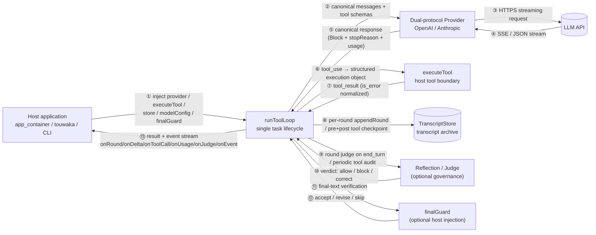
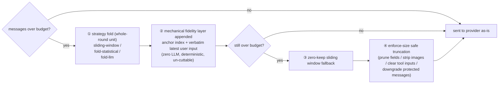
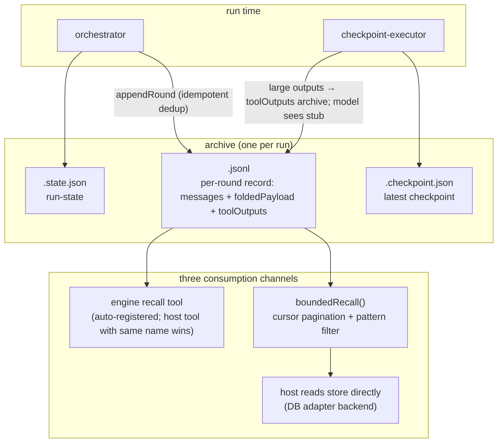

# Architecture Charts

> Three charts: ① simplified data flow (PPT-level) ② module architecture ③ end-to-end sequence (one task lifecycle).
> Terminology: **Host** = the application calling `runToolLoop` (app_container / touwaka / CLI);
> **run** = one `runToolLoop` invocation; **canonical message** = the engine-internal CanonicalMessage/Block format;
> **archive** = round records persisted by `TranscriptStore` (transcript-as-archive, ADR-015).
> Plus: **mechanism deep-dives** (context shaping / checkpoint-resume / judge governance / archive & recall) and an **architecture review Q&A** at the end.
>
> Sibling document (interface-contract level): [architecture.md](architecture.md); this one is "charts + why".

---

## Chart 1 · Simplified Data Flow (PPT-level)



### Key points

- **All five injection points are explicit**: `provider` (model I/O), `executeTool` (tool boundary), `store` (persistence), `modelConfig` (model configuration), `finalGuard` (final verification). The engine never discovers tools, never implements tools, never reads credentials — zero secrets in library source.
- **One-directional data flow**: tasks in, events out. `runToolLoop` owns exactly **one** task lifecycle (start/run/stop/resume/event stream); queues, arbitration, retry scheduling, and reapers belong to the host (ADR-012).
- **Model view ≠ archive source**: compaction only rewrites what is sent to the model; `foldedPayload` is persisted with the round record. Folding changes "what the model sees", never "what the archive stores".
- **Governance in the loop, policy outside it**: judge/governor is an optional in-engine layer (suggestions and corrections), but **which policy to enforce** (which project runs which agent, which operations need confirmation, network and write access) is the host's responsibility (ADR-009).

---

## Chart 2 · Module Architecture

```mermaid
flowchart TB
    subgraph host["Host side (outside the library, explicit injection)"]
        MC["ModelConfigProvider<br/>static / env / json-file"]
        EX["executeTool + ToolSchema<br/>tool implementations live here"]
        POL["Policy: quota / permission / network / confirmation<br/>not enforced by the engine (ADR-009)"]
    end

    subgraph entry["Entry layer"]
        IDX["src/index.js<br/>public exports (no implicit surface beyond tools)"]
        ASM["assembly.js<br/>one-time AssemblyPort validation → fine-grained options"]
    end

    subgraph core["loop/ orchestration core"]
        ORC["orchestrator.js<br/>runToolLoop main loop: round loop + wrapup parsing"]
        PRV["provider-runner.js<br/>call / retry / snapshot rollback"]
        CPE["checkpoint-executor.js<br/>pre+post tool checkpoints + per-round aggregate gate"]
        BUD["budget.js<br/>aggregate-budget.js<br/>budget and per-round output gate"]
        TERM["termination.js<br/>termination classification (11 reasons)"]
        RESM["resume-manager.js<br/>resume + run-state validation"]
        ELG["error-ledger.js<br/>repeated-error accounting"]
        TBR["task-brief.js / reflection.js / messages.js<br/>task brief / governance prompts / message ops"]
    end

    subgraph msg["messages/ canonical message model"]
        CAN["canonical.js<br/>Block ↔ OpenAI messages"]
        ANT["anthropic.js<br/>Block ↔ Anthropic Messages"]
        ONM["openai-normalization.js<br/>usage/stopReason/stream accumulation"]
        RND["rounds.js<br/>validation + whole-round grouping"]
        TOK["tokens.js (root)<br/>dependency-free token estimation"]
    end

    subgraph cpt["compact/ context shaping"]
        CB["budget.js<br/>computeBudget"]
        SW["sliding-window.js<br/>whole-round sliding window"]
        FS["fold-statistical.js<br/>deterministic folding + navigation record"]
        FL["fold-llm.js<br/>LLM summary + enforce-size"]
        ANC["anchors.js / fold-fidelity.js<br/>mechanical fidelity layer (zero LLM)"]
        ES["enforce-size.js<br/>deterministic pruning fallback"]
    end

    subgraph refl["reflection/ governance"]
        GOV["governor.js<br/>deterministic continue/stop decisions (side-effect free)"]
        JUD2["judge.js<br/>timeline + round judge / intercept audit"]
        L0["l0.js<br/>objective fact extraction"]
        WU["wrapup.js<br/>end-of-turn JSON parsing / LLM normalization"]
    end

    subgraph store2["store/ archive"]
        MEM["memory.js<br/>in-process Map"]
        FIL["file.js<br/>JSONL + state + checkpoint"]
        BR["bounded-recall.js<br/>cursor-based recall (ADR-015)"]
        NOT["notes.js<br/>host-side notes storage"]
    end

    subgraph cfg["config / tools / run-state"]
        CFG["config/<br/>static · env · json-file · api-key"]
        TR["tools/<br/>registry (code-owned executors)<br/>providers · recall"]
        RS["run-state.js<br/>bounded deterministic run state"]
    end

    subgraph cli["bin/ CLI (verifier / debugger, not the product)"]
        CLI1["cli.js chat<br/>one-shot task entry (bench entry point)"]
        REPL["repl.js<br/>interactive TUI"]
        MCPB["mcp.js / skills.js<br/>MCP proxy tools / skill discovery"]
        FGB["final-guard.js + guard-metrics.js<br/>provenance verification implementation"]
    end

    MC --> ASM
    EX --> ASM
    ASM --> ORC
    ORC --> PRV
    ORC --> CPE
    ORC --> BUD
    ORC --> TERM
    ORC --> RESM
    ORC --> ELG
    PRV --> CAN
    PRV --> ANT
    CAN --> RND
    ORC --> CB
    CB --> SW
    CB --> FS
    CB --> FL
    FS --> ANC
    FL --> ANC
    CB --> ES
    ORC --> GOV
    GOV --> JUD2
    JUD2 --> L0
    ORC --> WU
    ORC --> MEM
    ORC --> FIL
    BR --> MEM
    BR --> FIL
    TR --> ORC
    RS --> RESM
    IDX --> ORC
    CLI1 --> ASM
    REPL --> ORC
    MCPB --> ORC
    FGB --> ORC
    POL -. host responsibility .-> EX
```



### Key points

- **Pure ESM, zero npm dependencies**: only `node:` built-ins + relative paths. The 2.5k-line orchestration core concentrates in a single `orchestrator.js`; surrounding modules are small single-responsibility files with one-directional dependencies (compact/reflection/store/tools never depend back on loop).
- **The orchestration core (loop/) is the heart**: main loop, provider calls, checkpoint execution, budget, termination, resume, and error accounting are all assembled here; `reflection/` and `compact/` are side-effect-free "decision/transformation" modules only invoked by the loop.
- **The message layer is the single protocol adaptation point**: internally there is exactly one CanonicalMessage/Block format; OpenAI and Anthropic conversions + stream assembly live in `messages/` + `providers/`. Adding a protocol means adding one pair of adapters.
- **The CLI is not the product**: `bin/` is a verifier/debugger (chat one-shot + repl interactive + MCP/skill/final-guard implementations). The real evaluation surface is the external erix-bench headless harness; CLI archive/output-capture behavior is outside the library contract.
- **`erix-agent/tools` is an optional subpath**: tool registry, tool providers (static/json-file/composite), and the recall tool — the host may opt in; nothing is implicitly installed into runToolLoop.

---

## Chart 3 · End-to-End Sequence (what happens after one runToolLoop call)

```mermaid
sequenceDiagram
    autonumber
    actor H as Host
    participant L as runToolLoop<br/>(orchestrator)
    participant P as Provider<br/>(OpenAI / Anthropic)
    participant M as LLM API
    participant T as executeTool<br/>(host implementation)
    participant S as TranscriptStore
    participant J as Judge<br/>(optional governance)

    rect rgb(240, 244, 255)
    Note over H,L: Phase 0 — assembly validation (once; failure throws TypeError)
    H->>L: runToolLoop({provider, executeTool, store, modelConfig, ...})
    L->>L: option whitelist validation (with typo hints) + AssemblyPort method assertions
    Note over L: recall / outputHygiene capability checks<br/>(explicit true without capability = throw, no silent promises)
    end

    rect rgb(240, 255, 240)
    Note over L,S: Phase 1 — restore (only when resume=true)
    L->>S: load(runId) + loadLatestCheckpoint + loadRunState
    S-->>L: messages / pending tool_use / run state
    Note over L: replay pending tool calls in original order<br/>(side-effect idempotency is the host's duty)
    end

    rect rgb(255, 250, 235)
    Note over L,M: Phase 2 — round loop (every round)
    L->>L: compactBeforeRound (shaping pipeline, see mechanism 1)
    L->>P: chat / chatStream (canonical messages + tool schemas + sampling params)
    P->>M: HTTPS + SSE
    M-->>P: streamed chunks (delta / reasoning / tool_call)
    P-->>L: ChatResponse (Block[] + stopReason + usage)
    alt stopReason = tool_use
        L->>J: audit the next call transparently, every 5 real tool executions
        J-->>L: done:false blocks and returns audit result / off_track adds direction hint / allow
        L->>S: checkpoint (pre-tool) — failure → sideEffect=not_started, execution blocked
        L->>T: executeTool({id, name, input, context, signal})
        T-->>L: tool_result (large outputs archived as stubs; model sees summary, ADR-015)
        L->>S: checkpoint (post-tool) + appendRound (idempotent dedup)
    else stopReason = end_turn
        L->>L: wrapup JSON parsing (done:true → finish; false → inject continuation)
        L->>J: round judge evaluates end_turn (separate or shared provider)
        J-->>L: done:true + confidence≥0.7 → judge_done<br/>otherwise inject corrective message and continue
    end
    L->>L: governor deterministic verdict (stall / no-tool streak / deadline / budget extension)
    end

    rect rgb(255, 240, 240)
    Note over H,L: Phase 3 — termination and final verification
    L->>H: finalGuard({finalText, messages, termination, ...})
    H-->>L: accept → verified / revise → inject and continue / skip
    Note over L: retry limit 2 / timeout 30s;<br/>non-continuable stop → unverified
    end

    rect rgb(245, 240, 255)
    Note over H,S: Phase 4 — result and event stream
    L-->>H: result{finalText, termination, verification, usage, compactionStats}
    L-->>H: full-event stream onRound / onDelta / onToolCall / onUsage / onJudge / onEvent
    Note over S: archive complete: per-round JSONL + folded payload + checkpoint + run-state<br/>— the host can reconcile, replay, and audit
    end
```

### Key points

- **Phase 0 is a fail-fast contract**: unknown options (with near-name hints), missing methods, illegal policy keys, and missing capabilities all throw before the provider is called — host integration errors can never detonate mid-run.
- **The tool path in Phase 2 carries audit and checkpoints**: the intercept judge only blocks "write paths" (read-only tools readFile/tree/rg/note_read/note_list/recall are exempt); a pre-tool checkpoint failure blocks execution outright, a post-tool failure marks `executed_uncommitted` while keeping the result.
- **`max_tokens` truncation continues within the same round**: when reasoning models over-think and truncate, up to 3 continuations (`maxTokenContinuations`) are issued, compacting first if already over budget — the budget is not burned in a truncation loop (issue #11).
- **Phase 3: only `verified` may be treated as verified**: `skipped`/`unverified`/`error` all demand host-specific handling; a guard error or timeout is **not** verified either.
- **Phase 4: `result.transcript` is only an in-memory snapshot**: the authoritative archive lives in the `TranscriptStore`; the two are deliberately separated so the host can swap in a DB backend (implement the nine methods; see ADR-002).

---

## Mechanism 1 · Context Shaping Pipeline (compaction ladder)

> Goal: never let an over-budget request reach the provider — while preserving as much task-relevant information as possible.



### Why it's built this way (five points)

- **Whole-round folding never breaks the chain**: a `tool_use` must be immediately followed by its matching `tool_result` — a protocol invariant. Folding operates on whole rounds (assistant message + its following user tool_result), so normal folding cannot create orphan tool messages; `validateMessages` re-asserts before every provider call.
- **LLM summaries are not trusted, so a mechanical fidelity layer is stacked on top**: LLM paraphrase inevitably loses precision (a commit SHA becomes "some commit"). `anchors.js` mechanically extracts paths/SHAs/issues/URLs/error lines (≤20 entries, ≤1200 chars) from the folded rounds' **original text**; `fold-fidelity.js` quotes the user's latest unresolved input verbatim (≤800 chars) and detects abort/revoke-style reverse signals — none of it rewritten by a model, and none of it cuttable by the summary budget.
- **`fold-llm` summary size is enforced deterministically**: an LLM-produced summary passes `enforceSize` before entering context; an over-long summary from a model that "forgot to finish" is mechanically trimmed and cannot blow the budget.
- **System head and first user message never fold**: all whole-round strategies keep the system head + first real user message; protected messages are not downgraded on normal paths — only the level-④ fallback may downgrade them (recorded in `compactionStats[].protectedDowngraded`); a single protected message that cannot fit raises `KitError("invalid_budget")` instead of silently corrupting.
- **Fold products are archived**: `foldedPayload` + the navigation record (fold-statistical's deterministic tool footprint) enter the round record — forgotten details can be recovered via recall, and the archive is the recovery source (ADR-015: folding changes the model view, never the archive source).

---

## Mechanism 2 · Checkpoint & Resume

> Goal: after a process kill, provider failure, or container reclaim, the run continues from the breakpoint — without double side effects.

- **Twin checkpoints bracket tool execution**: a pre-tool checkpoint persists "about to execute this tool_use"; a post-tool one persists "executed + result". Pre-tool failure → `sideEffect: "not_started"`, **execution blocked**; post-tool failure → `executed_uncommitted`, result kept but explicitly marked uncommitted.
- **Resume = replay pending tool_use in original order**: resume loads messages + latest checkpoint + run-state, then re-hands the unfinished tool calls after the checkpoint to `executeTool`. **The engine guarantees order and accounting, not side-effect idempotency** — the host must make side-effecting executeTool implementations idempotent (stated in the contract, not a hidden assumption).
- **Two persistence semantics**: with a store, `required` is the default (all nine methods validated, writes follow the retry policy, exhaustion → `persistence_failed` termination); explicit `none` bypasses everything. A failed archive write terminates explicitly — never "pretend archived" and continue.
- **Run state is bounded and deterministic**: `run-state.js` maintains tool stats, fold counts, budget prompts, etc. (capped at `RUN_STATE_MAX_CHARS`), validates shape and version on resume, and marks corrupted state unavailable instead of silently reusing it; "this-budget" flags like `lowBudgetPrompted` do not carry across resume.

---

## Mechanism 3 · Judge Governance (round judge + tool intercept + governor)

> Goal: in unattended scenarios nobody is watching — the engine must notice "off-track / stuck / should wrap up" by itself. But governance only **advises and corrects**; it never makes policy decisions.

- **Round judge (end_turn evaluation)**: the model saying "done" is not done. A separate (or shared) provider evaluates the final response against an objective timeline (tool calls, file footprint, L0 facts); only `done:true` with `confidence ≥ 0.7` yields `judge_done`, otherwise a corrective message is injected and the run continues. Parse failures and evaluator errors **degrade** to the plain governor; after 3 consecutive failures the judge disables itself — a governance failure can never deadlock the run.
- **Transparent tool audit (intercept)**: every 5 real tool executions, the next call is audited: `done:false` blocks the original execution and returns the audit result to the model as its tool_result (the model learns *why* it shouldn't, not a silent failure); `off_track` never blocks, it only adds a direction hint to the next round's context. `ERIX_NO_ROUND_JUDGE=1` disables the round judge independently.
- **Read-only tool exemption**: readFile / tree / rg / note_read / note_list / recall are allowed through — blocking them is net-negative (measured: blocking readFile actually leaked defects). Write paths (exec/writeFile/mcp etc.) keep interception semantics.
- **The governor is deterministic**: a pure, side-effect-free function mapping signals (stall streak, no-tool streak, error repeat count, remaining time, extension count) to continue/stop/wrap-up actions. Hard budget expiry lands softly — a wrap-up nudge is injected rather than a hard kill.
- **Adaptive budget**: past the reflection trigger (default `maxRounds × 0.8`), if the governor sees continued progress it can extend the budget (step 32, at most 2 times, capped at `maxRoundsCap ≥ 256`) — long tasks are neither killed by the initial round count nor allowed to inflate forever.

---

## Mechanism 4 · Archive & Recall (ADR-015: transcript-as-archive, recall-as-channel)



### Key points

- **Large outputs don't blow up context**: `outputHygiene` (default limit 4096) stores oversized tool_result originals in the round record's `toolOutputs`; the model sees a stub + pointer. A per-round aggregate gate (`aggregate-budget`) backstops the total — archive intact, context unharmed.
- **Recall is a bounded protocol**: `boundedRecall` cursors bind run / range / pattern / limit / artifactRef / **source version**; changed source reports `stale`, missing records report `unrecoverable`, oversized records report `record_too_large` — never "looks successful" dirty data.
- **The engine recall tool is zero-config**: auto-registered when a store + runId exist (a host-defined recall tool with the same name takes precedence); after early context is compacted away, the model can recover it via recall itself.
- **The file store is a reference implementation**: one JSON record per JSONL line, repairs a missing trailing newline, isolates corrupt tail fragments; the contract assumes **a single writer** (one per runId per process) — cross-process locking is out of contract. Hosts needing concurrency/shared storage implement the same nine methods over a database.

---

## Boundary Table: Engine-owned vs Host-owned

| Concern | Engine (this library) | Host (caller) |
|---|---|---|
| Single task lifecycle | start / run / stop / resume / event stream | when to start, which task to start |
| Model I/O | dual-protocol providers, timeout classification, retries, canonical message conversion | endpoint/model/key configuration (`modelConfig.resolve(slot)`), quota and fallback policy |
| Tools | `executeTool` as the single execution entry, input validation, result normalization | tool implementations, permission policy, which operations need human confirmation |
| Security | enforces no policy (ADR-009); executor registry is code-owned — data cannot extend capability | local = trust domain; sandbox/container isolation done by the host |
| Context | budget, folding, fidelity layer, safe truncation fallback | budget parameters (contextWindow/maxOutputTokens), strategy selection |
| Governance | judge advice, interception, correction, governor continue/stop verdicts | final decision authority and human-escalation channel |
| Archive | TranscriptStore protocol + memory/file reference implementations | storage backend (DB/object storage), retention, audit process |
| Orchestration | — (deliberately out of scope) | queues, arbitration, retry scheduling, reapers, multi-role (ADR-012) |

---

## Architecture Review Q&A

> The most frequently asked questions, with short answers; the last row is an **explicitly accepted trade-off**.

| Question | Answer |
|---|---|
| Why insist on zero npm dependencies? | Hosts are mostly embedded/audit-sensitive scenarios (app_container, touwaka). Depending on third-party frameworks = pushing supply-chain risk and version churn onto every host. Pure ESM + `node:` built-ins lets the engine absorb "contain third-party framework churn" once. The cost — hand-written SSE parsing and token estimation — is pinned by contract tests. |
| Why an internal canonical message model instead of passing OpenAI/Anthropic through? | Dual-protocol is today's reality, not the architectural center. The canonical Block layer lets compaction/judge/recall face exactly one structure; adding a protocol = adding one adapter pair without touching the engine. `validateMessages` asserts protocol invariants before every provider call. |
| Why checkpoint both before and after a tool call? | Pre-only: a crash after execution leaves "said it would, unknown whether it did". Post-only: a crash before execution loses the "about to" intent. Twin checkpoints let the restoring side distinguish `not_started` (safe replay) from `executed_uncommitted` (must not blindly replay) precisely, drawing the idempotency responsibility line clearly. |
| Does judge interception slow down or mis-block normal tool calls? | Audits carry a 30s timeout; errors/timeouts always **degrade to direct execution** (fail-open execution, fail-closed governance); read-only tools are exempted as a class; `off_track` only hints, never blocks. Every governance-failure path falls back to "the plain loop without a judge". |
| What if an LLM-produced fold summary is untrustworthy? | Three layers of defense: ① summaries pass deterministic `enforceSize` before entering context; ② anchor index / user-input quotes are mechanically extracted, never LLM-rewritten; ③ originals are kept in `foldedPayload` in the archive, recoverable via recall. Summaries may lose narrative, never facts. |
| Can resume guarantee side effects happen exactly once? | No — and the contract says so: the engine guarantees order, accounting, and checkpoint semantics; whether an "executed but uncommitted" side effect should replay, only the host knows (a bank transfer must not replay; a file read may). The host must make executeTool idempotent. Packaging "exactly-once" as an engine capability would be a lie, so it is not done. |
| Does TranscriptStore support multi-process concurrent writes? | No; the contract is "single writer per runId per process". The file store only isolates corrupt tail fragments and deduplicates idempotently — no cross-process locking. Hosts needing concurrency/shared storage go through a DB backend and use the database's own transactions. |
| Why no queues / retry scheduling / multi-role orchestration in the engine? | ADR-012: the engine boundary ends at a single task lifecycle. Absorbing orchestration turns a small runtime into a headless platform, and zero-dependency plus a stable contract would both erode. Hosts (touwaka/app_container) already have schedulers. |
| Who owns model quota and fallback to a backup model? | The host. Engine discipline (AGENTS.md §8): model names are never hardcoded; an unavailable model **fails immediately**; silent fallback never happens — users switch models for cost/quota reasons, and silently switching back is a betrayal. |
| Can compaction trim context to the point the task can't finish? | Possibly — hence the mitigations: the governor detects "amnesia responses" (model claims done with no tool footprint) and injects a recovery prompt + the recall channel to recover early context; fold-statistical leaves a deterministic navigation record. The engine admits compression is lossy and makes "recovery" a first-class capability instead of pretending losslessness. |
| The security model in one sentence? | The engine enforces no security policy (ADR-009). Local execution = granting the local trust domain; embedded/sandboxed deployments are isolated by the host. The CLI tools intentionally allow arbitrary paths and shell, with no allowlist and no confirmation prompt — "whether to block" is host policy, not half a policy hidden in the library. |
| How does this document relate to architecture.md? | `architecture.md` is the **interface contract** (field-by-field, option-by-option specification); this document is **architecture charts + design rationale**. They complement each other. For the source layout, chart 2 here is authoritative (`src/loop/` has become a directory; anchors/fold-fidelity/aggregate-budget and other newer modules are included). |
