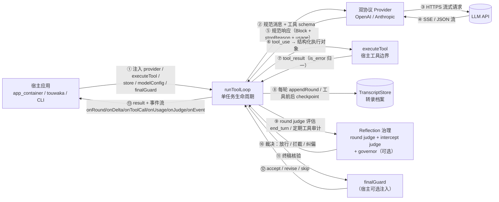
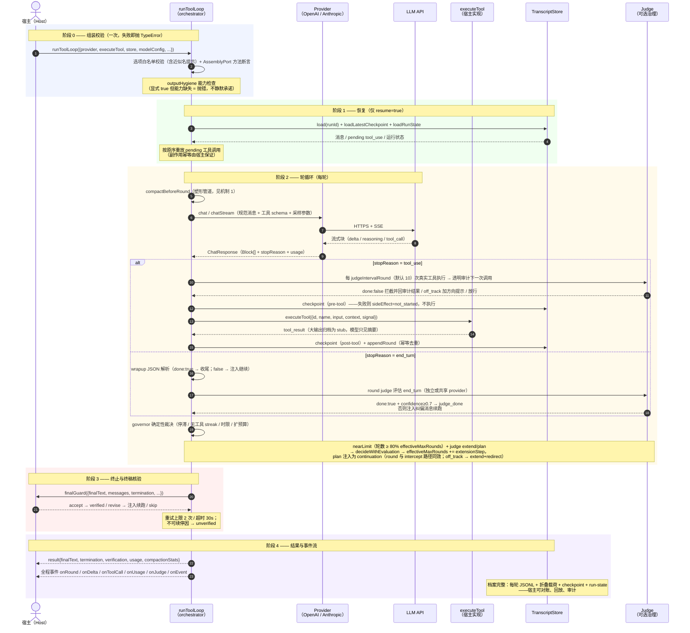
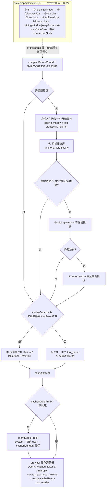
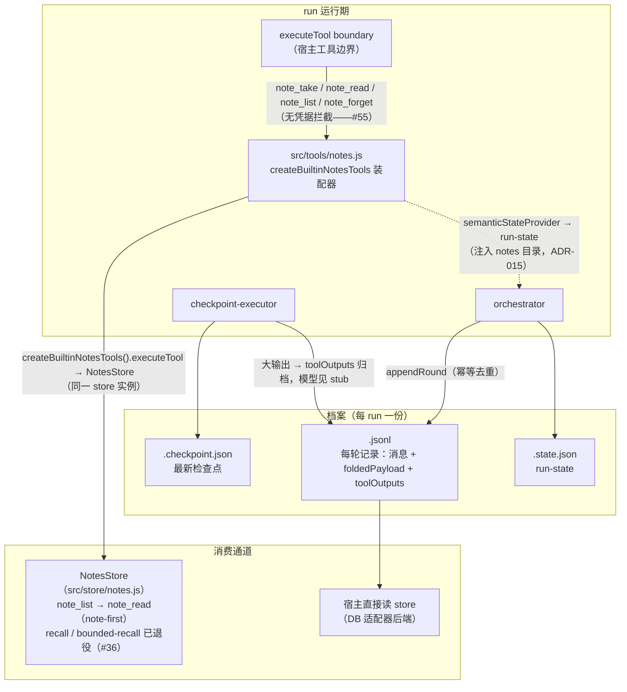

# 架构图（中文版）

> 三张图：① 简化数据流（PPT 级）② 模块架构 ③ 端到端时序（单任务生命周期）。
> 术语：**宿主（Host）** = 调用 `runToolLoop` 的应用（app_container / touwaka / CLI）；
> **run** = 一次 `runToolLoop` 调用；**规范消息** = 引擎内部 CanonicalMessage/Block 格式；
> **档案** = `TranscriptStore` 持久化的 round 记录（转录即档案）；**小抄** = note 工具的运行期要点存储（note-first 取回，ADR-016 退休补充）。
> 另附：**机制解析**（上下文塑形 / 检查点续接 / Judge 治理 / 档案与小抄）与**架构评审说明**（文末 Q&A）。
>
> 姊妹篇（接口契约级描述）：[architecture_cn.md](architecture_cn.md)；本文聚焦"图 + 为什么"。

---

## 图 1 · 简化数据流（PPT 级）



### 要点

- **五个注入点全部显式**：`provider`（模型 I/O）、`executeTool`（工具边界）、`store`（持久化）、`modelConfig`（模型配置）、`finalGuard`（终稿核验）。引擎不发现工具、不实现工具、不读凭据——库源码零密钥
- **单向数据流**：任务进、事件出。`runToolLoop` 只拥有**一个**任务生命周期（start/run/stop/resume/event stream）；队列、仲裁、重试调度、收割都属于宿主（ADR-012）
- **模型视图 ≠ 档案源**：compaction 只改写发给模型的上下文；`foldedPayload` 随 round 记录入档案。折叠改变"模型看到什么"，不改"档案存了什么"
- **治理在环内、策略在环外**：judge/governor 是引擎内可选层（做“建议与纠偏”），但**执行什么策略**（哪个项目跑哪个 agent、什么操作要确认、网络与写权限）由宿主负责（ADR-009）
- **请求形态对缓存友好**：`cacheStablePrefix`（默认开）把 system + 首条真实 user 消息标记为稳定前缀（`cacheBoundary` 提示）交给 provider 缓存适配器——OpenAI `cached_tokens` / Anthropic `cache_read_input_tokens`，归一化为 `usage.cacheRead`/`cacheWrite`；`cacheCapable` 端点下工具结果 TTL 默认取 0（显式 `toolResultTtl` 始终优先），保住 provider 前缀缓存命中率

---

## 图 2 · 模块架构

```mermaid
flowchart TB
    subgraph host["宿主侧（库外，显式注入）"]
        MC["ModelConfigProvider<br/>static / env / json-file"]
        EX["executeTool + ToolSchema<br/>工具实现归宿主"]
        POL["策略：配额 / 权限 / 网络 / 确认<br/>引擎不执行（ADR-009）"]
    end

    subgraph entry["入口层"]
        IDX["src/index.js<br/>公共导出（无 tools 以外的隐式面）"]
        ASM["assembly.js<br/>AssemblyPort 一次性校验 → 细粒度选项"]
    end

    subgraph core["loop/ 编排核心"]
        ORC["orchestrator.js<br/>runToolLoop 主循环：轮循环 + wrapup 解析"]
        PRV["provider-runner.js<br/>调用 / 重试 / 快照回滚"]
        CPE["checkpoint-executor.js<br/>工具前后检查点 + 单轮聚合闸门"]
        BUD["budget.js<br/>aggregate-budget.js<br/>预算与单轮输出闸门"]
        TERM["termination.js<br/>终态归类（11 种 reason）"]
        RESM["resume-manager.js<br/>断点恢复 + run-state 校验"]
        ELG["error-ledger.js<br/>重复错误记账"]
        TBR["task-brief.js / reflection.js / messages.js<br/>任务简报 / 治理提示 / 消息操作"]
    end

    subgraph msg["messages/ 规范消息模型"]
        CAN["canonical.js<br/>Block ↔ OpenAI 消息"]
        ANT["anthropic.js<br/>Block ↔ Anthropic Messages"]
        ONM["openai-normalization.js<br/>usage/stopReason/流聚合"]
        RND["rounds.js<br/>校验 + 整轮分组"]
        TOK["tokens.js（根）<br/>零依赖 token 估算"]
    end

    subgraph cpt["compact/ 上下文塑形"]
        CB["budget.js<br/>computeBudget"]
        SW["sliding-window.js<br/>整轮滑窗"]
        FS["fold-statistical.js<br/>确定性折叠 + 导航记录"]
        FL["fold-llm.js<br/>LLM 摘要 + enforce-size"]
        ANC["anchors.js / fold-fidelity.js<br/>机械保真层（零 LLM）"]
        ES["enforce-size.js<br/>确定性裁剪兜底"]
        PIPE["pipeline.js<br/>六层注册表 + fallback chain<br/>+ 逐层统计（声明）"]
    end

    subgraph refl["reflection/ 治理"]
        GOV["governor.js<br/>确定性续停裁决（无副作用）"]
        JUD2["judge.js<br/>时间线 + 轮判 / 拦截审计"]
        L0["l0.js<br/>客观事实抽取"]
        WU["wrapup.js<br/>收尾 JSON 解析 / LLM 归一"]
    end

    subgraph store2["store/ 档案"]
        TS["TranscriptStore 端口<br/>8 方法契约（ADR-002）"]
        MEM["memory.js<br/>进程内 Map（参考实现）"]
        FIL["file.js<br/>JSONL + state + checkpoint（参考实现）"]
        NSTORE["store/notes.js<br/>NotesStore（run 级要点）"]
    end

    subgraph cfg["config / tools / run-state"]
        CFG["config/<br/>static · env · json-file · api-key"]
        TR["tools/<br/>registry（executor 代码持有）<br/>providers"]
        NTOOL["tools/notes.js<br/>createBuiltinNotesTools 装配器"]
        RS["run-state.js<br/>有界确定性运行状态"]
    end

    subgraph cli["bin/ CLI（校验器 / 调试器，非产品）"]
        CLI1["cli.js chat<br/>单发任务入口（可作 bench 入口）"]
        REPL["repl.js<br/>交互 TUI"]
        MCPB["mcp.js / skills.js<br/>MCP 代理工具 / 技能发现"]
        FGB["final-guard.js + guard-metrics.js<br/>provenance 核验实现"]
        ASMROOT["assembly-root.js<br/>composition root：文件 store +<br/>notesStore + archiveDir"]
    end

    MC --> ASM
    EX --> ASM
    ASM --> ORC
    ORC --> PRV
    ORC --> CPE
    ORC --> BUD
    ORC --> TERM
    ORC --> RESM
    ORC --> ELG
    PRV --> CAN
    PRV --> ANT
    CAN --> RND
    ORC --> CB
    CB --> SW
    CB --> FS
    CB --> FL
    FS --> ANC
    FL --> ANC
    CB --> ES
    ORC --> PIPE
    ORC --> GOV
    ORC --> JUD2
    JUD2 --> L0
    RESM --> L0
    ORC --> WU
    ORC -. "只消费 store 端口（options.store）" .-> TS
    MEM -. "参考实现" .-> TS
    FIL -. "参考实现" .-> TS
    NTOOL -- "executeTool → NotesStore<br/>（同一 store 实例）" --> NSTORE
    ASMROOT -- "createFileTranscriptStore" --> FIL
    ASMROOT -- "createFileNotesStore" --> NSTORE
    TR --> ORC
    RS --> RESM
    IDX --> ORC
    CLI1 --> ASMROOT
    REPL --> ASMROOT
    CLI1 -- "细粒度 options → runToolLoop" --> ORC
    REPL -- "细粒度 options → runToolLoop" --> ORC
    CLI1 -. "createBuiltinNotesTools" .-> NTOOL
    REPL -. "createBuiltinNotesTools" .-> NTOOL
    MCPB -- "MCP 代理 / 技能工具" --> CLI1
    MCPB --> REPL
    FGB --> CLI1
    FGB --> REPL
    POL -. 宿主责任 .-> EX
```



### 要点

- **纯 ESM、零 npm 依赖**：只 import `node:` 内置模块 + 相对路径；编排核心 2500 行集中在一个 `orchestrator.js`，周边模块按职责切小文件，依赖单向指向（compact/reflection/store/tools 不反向依赖 loop）
- **编排核心（loop/）是心脏**：主循环、provider 调用、检查点执行、预算、终态、恢复、错误记账全部在这里被组装；`reflection/` 与 `compact/` 是由 loop 驱动的“决策/变换”模块、只被 loop 调用——governor/judge 提示构造是纯函数，fold-llm/wrapup 可调用注入的 summarizer/evaluator（外部调用，绝不硬编码）
- **消息层是唯一协议适配点**：内部只有一套 CanonicalMessage/Block；OpenAI 与 Anthropic 双向转换 + 流式聚合都在 `messages/` + `providers/`，新增协议只需加一对适配器
- **CLI 不是产品**：`bin/` 是校验器/调试器（chat 单发 + repl 交互 + MCP/技能/final-guard 实现），真正验收面是外部 erix-bench 无头 harness；CLI 的 archive/输出捕获行为不属于库契约
- **`erix-agent/tools` 是可选子路径**：工具注册表、工具 provider（static/json-file/composite）——宿主可按需取用，不是隐式安装进 runToolLoop 的工具集（recall 已退役，issue #36）

---

## 图 3 · 端到端时序（一次 runToolLoop 调用之后发生什么）



### 要点

- **阶段 0 是 fail-fast 契约**：未知选项（含拼写近似提示）、缺方法、策略键非法、能力缺失全部在调 provider 之前抛错——宿主集成错误不可能拖到运行期才炸
- **阶段 2 的工具路径带审计与检查点**：拦截 judge 只拦“写路径”（readFile/tree/rg/note_read/note_list 只读工具豁免）；pre-tool checkpoint 失败直接阻断执行，post-tool 失败标记 `executed_uncommitted` 但结果保留
- **max_tokens 截断在同轮内续写**：reasoning 模型推理过长触发截断时最多续 3 次（`maxTokenContinuations`），续写前若已超预算先压缩——不会把预算耗死在截断循环（issue #11）
- **阶段 3 只有 `verified` 能当"已核验"用**：`skipped`/`unverified`/`error` 都要求宿主自行处理；guard 自身报错/超时也**不算** verified
- **阶段 4 的 result.transcript 只是内存快照**：权威档案在 `TranscriptStore`；两者刻意分离，宿主可换 DB 后端（实现八方法即可，见 ADR-002）

---

## 机制解析 1 · 上下文塑形管道（compaction ladder）

> 心智模型：**TTL 管“单结果生命周期”，整轮策略管“预算超限应急”**。TTL
> 不改变规范消息、不写档案；整轮折叠才改变下一次请求的模型视图，并把原文
> `foldedPayload` 随轮档案保存。六层的有序声明集中在
> `src/compact/pipeline.js`，本文描述的是该声明驱动的运行时行为。



### 六层注册表（顺序、触发、粒度与产物）

注册表的顺序是稳定的六层心智模型（TTL 是包住 provider 请求的外层机制）；其中 `slidingWindow` 同时承担“无策略时的
预算折叠”和“策略产物仍超限时的零保留兜底”，所以它在一次请求里可能出现在
选定策略之前或之后。`foldStatistical` 与 `foldLlm` 是互斥的选定整轮策略，
不是连续执行的两次折叠。

- **`cacheCapable` 只改 TTL 默认值**（`orchestrator.js:480-482`）：`cacheCapable: true`
  且未显式指定 `toolResultTtl` 时，该请求 TTL 解析为 0（单结果折叠关闭，保住
  provider 前缀缓存）；显式 `toolResultTtl` 始终优先；整轮折叠策略完全不受影响——
  不是“删除 whole-round compaction”。
- **`cacheStablePrefix` → provider 缓存适配器**（默认开）：每次请求前
  `markStablePrefix`（`provider-runner.js:20`）把 system + 首条真实 user 消息打上
  `cacheBoundary` 提示；两个协议适配器各自映射（OpenAI `cached_tokens` /
  Anthropic `cache_read_input_tokens`），归一化为 `usage.cacheRead`/`cacheWrite`。

| 层（注册表顺序） | 触发条件 | 粒度 | 进入模型/档案的产物 |
|---|---|---|---|
| `ttl` | 每次 provider attempt；配置允许且结果估算 token 达到 `minTokens`：`currentRound - erixRound >= ttl` 时折为句柄，`age === ttl - 1` 时只追加预警。错误结果、`note_`/`todo_`、缺少轮号的旧结果保守不折。其 `triggered` 只统计实际折叠的 `tool_result` 数量，不统计仅预警的请求 | 单个 `tool_result` | 仅请求视图中的 `【已折叠·TTL】`句柄，含工具/入参片段、估算 token、读取轮、取回提示；可附 `导航` digest 与 JSON `骨架`。临界前一轮只追加 TTL 预警。`ctx.messages`、checkpoint、round archive 保留全文 |
| `slidingWindow` | 预算超限且没有选定整轮策略（包括已配置策略但其 `shouldCompact()` 返回 false），或选定策略完成后本地估算/API 输入投影仍超限；兜底使用 `keepRounds: 0` | 整轮（assistant + 配对 `tool_result`） | 保留 head/受保护轮与近期轮；被折轮原文进入 `foldedPayload`，可把 `stubFor` 结果追加到 head，并生成有界 `navigationRecord` |
| `foldStatistical` | `context.strategy` 主动要求压缩且策略名为 `fold-statistical` | 整轮 | 带折叠轮范围、工具足迹、存根、恢复提示、导航记录的确定性摘要；`foldedPayload` 与摘要分离保存 |
| `foldLlm` | `context.strategy` 主动要求压缩且策略名为 `fold-llm` | 整轮 | 注入的 summarizer 生成摘要；摘要先过 `enforceSize`，失败时降级统计摘要；随后可追加机械保真段；原文仍在 `foldedPayload` |
| `anchors` | 整轮折叠实际产生 anchors 或 fold-fidelity 段落；`anchors: false` 只关闭锚点索引，`fold-llm` 的用户引文/反向信号仍可能触发 | 被折整轮中的可识别原文片段 | `anchors.js` 从 tool-result 与真实 user 文本机械抽取路径、SHA、issue、URL、错误行（最多 20 条/1200 字符）；`fold-llm` 另外由 `fold-fidelity.js` 逐字引用最新未解决 user 输入（最多 800 字符）并标出撤销信号。零 LLM，不承担档案导航 |
| `enforceSize` | fold-llm 的摘要尺寸强制，或所有策略/滑窗之后仍超预算的最终安全截断 | 字段/消息（最终兜底也会按完整轮移除） | 低优先级字段替换为 `[已修剪]`，移除图片、清空 tool input，必要时降级受保护消息；`protectedDowngraded` 记录降级，单条受保护消息仍放不下则抛 `invalid_budget` |

### 一轮请求的精确时序

1. `compactBeforeRound` 先在**原始规范消息**上估算 token；只要配置了策略，
   就会无条件调用 `context.strategy.shouldCompact(...)`，即使没有预算。策略钩子
   返回真，或存在预算且本地估算/API 最近一次输入超过预算时，才启动整轮链。
   没有选定整轮策略（包括已配置策略但其钩子返回假）时，超预算使用
   `sliding-window`。
2. 选定策略折叠完整轮次；system head、第一条真实 user 消息和配置的受保护轮
   正常路径不折。整轮折叠先生成摘要/存根/保真产物，并计算新的 token 估算。
3. 结果仍超过预算时才执行 `sliding-window(keepRounds: 0)`；仍超过时执行
   `safeTruncateMessages`，其中 `enforce-size.js` 是字段级确定性安全截断器。
4. 消息回写 `ctx.messages` 后刷新 run-state；随后 provider-runner 才按本轮 TTL
   配置构造请求副本，校验 tool_use/tool_result 配对，再发送给 provider。TTL
   只作用于这个副本，因此不会被 `foldedPayload` 或档案恢复语义混入。

### TTL digest 与导航记录的边界

两者都可能出现“原文长什么样”的文字，但职责不同，不能互相替代：

- **TTL digest** 是单个大 `tool_result` 的短期、请求级句柄：服务于模型在当前
  对话中识别“这是哪个工具结果、如何回到已有笔记”，不表示整轮已经归档，也不
  统计被折轮范围；请求结束后不单独持久化。
- **`navigationRecord`** 是整轮折叠的档案索引：从 `foldedPayload` 的 artifact
  元数据构造，记录轮范围、artifact locator/digest/status，并随 round record
  保存；服务于宿主审计、恢复和 note-first 取回，不复述 tool-result 正文。

### 产物、统计与恢复不变量

- `tool_use` 必须和匹配的 `tool_result` 保持协议配对；整轮策略以完整轮为单位，
  provider 调用前再次 `validateMessages`。
- `foldedPayload` 永远是被折原文的归档载荷，摘要只是模型视图；恢复仍先取在场
  笔记，再用 `note_list`/`note_read`，不猜测未记录且不可确定性重算的值。
- `compactionStats` 保留既有 `compacted`、`foldedRounds`、`tokensBefore`、
  `tokensAfter` 字段，并新增六层统一明细：

  ```js
  layers: {
    ttl: { triggered: 0, tokensSaved: 0 },
    slidingWindow: { triggered: 0, tokensSaved: 0 },
    foldStatistical: { triggered: 0, tokensSaved: 0 },
    foldLlm: { triggered: 0, tokensSaved: 0 },
    anchors: { triggered: 0, tokensSaved: 0 },
    enforceSize: { triggered: 0, tokensSaved: 0 },
  }
  ```

  `triggered` 是该层实际产出/执行的次数；对 `ttl` 特别表示实际折叠的单个
  `tool_result` 数量，仅预警不计数。`tokensSaved` 是该层前后估算 token 的
  非负节省量（保真层不以增加的 token 冒充节省）。这些统计是有界保留而非无限
  历史：`normalizeCompactionStats` 保留最近 32 条；run-state 序列化超出大小
  上限时再缩至最近 8 条。每条统计同时挂在返回结果、当前 run-state、
  checkpoint/round archive 与 `onEvent({ type: "compaction" })` 事件上，便于
  宿主按层查询。

---

## 机制解析 2 · 检查点 / 续接（checkpoint & resume）

> 目标：进程被杀、provider 挂了、容器被回收之后，run 能从断点继续，且副作用不重复。

- **双检查点夹住工具执行**：pre-tool checkpoint 落盘"我将执行这个 tool_use"；post-tool 落盘"已执行 + 结果"。pre-tool 失败 → `sideEffect: "not_started"`，**阻断执行**；post-tool 失败 → `executed_uncommitted`，结果保留但明确标记未提交
- **恢复 = 按原序重放 pending tool_use**：resume 加载消息 + 最新 checkpoint + run-state，把 checkpoint 之后未完成的工具调用重新交给 `executeTool`。**引擎保证顺序与记账，不保证副作用幂等**——宿主必须让有副作用的 executeTool 实现幂等（契约明示，不是隐藏假设）
- **持久化两档语义**：配了 store 默认 `required`（八方法全验、写入走重试策略、耗尽 → `persistence_failed` 终止）；显式 `none` 则全旁路。存档写不进 = 明确终止，绝不"假装存档成功"继续跑
- **run-state 有界且确定性**：`run-state.js` 维护工具统计、折叠计数、预算提示等确定性状态（`RUN_STATE_MAX_CHARS` 上限），resume 时校验版本与形状，损坏则标记不可用而**不**静默沿用；`lowBudgetPrompted` 这类"本次预算"状态不跨 resume 继承

---

## 机制解析 3 · Judge 治理（round judge + 工具拦截 + governor）

> 目标：无头场景没人盯着，引擎要自己能发现"跑偏了/卡住了/该收尾了"——但治理只给**建议与纠偏**，越权决策不做。

- **round judge（end_turn 评估）**：模型说"做完了"不等于做完。独立（或共享）provider 用客观时间线（工具调用、文件足迹、L0 事实）评估终稿，`done:true` 且 `confidence ≥ 0.7` 才判 `judge_done`；否则注入纠偏消息续跑。解析失败/评估器错误**降级**到普通 governor，连续失败 3 次后停用 judge——治理故障永远不把 run 卡死
- **工具透明审计（intercept）**：每 `judgeIntervalRound` 次真实工具执行（默认 **10**；`reflection.judgeIntervalRound` 或 `ERIX_JUDGE_INTERVAL` 可覆盖，`orchestrator.js:799-813`），审计下一次调用：`done:false` 拦截原执行并把审计结果当 tool_result 还给模型（模型得到“为什么不该这么做”而不是静默失败）；`off_track` 不拦工具，只给下一轮上下文加方向提示。`env ERIX_NO_ROUND_JUDGE=1` 可独立关轮判
- **只读工具豁免**：readFile / tree / rg / note_read / note_list 被拦净收益为负（实测拦 readFile 反而漏缺陷）——审计对这类调用直接放行，写路径（exec/writeFile/mcp 等）维持拦截语义
- **governor 是确定性的**：纯函数、无副作用，输入信号（停滞 streak、无工具 streak、错误重复数、剩余时间、扩预算次数）输出续/停/收尾动作。硬预算到期前以"引导收尾"软着陆（注入 wrap-up 提示），而非硬杀
- **自适应预算**：越过 reflection 触发点（`nearLimit`，轮数 ≥ `effectiveMaxRounds` 的 80%）后 governor 进入扩轮考虑——真正扩轮需要 judge 裁决（`extend:true` + plan）：`effectiveMaxRounds += extensionStep`（默认 32，上限 `maxRoundsCap`），最多 `maxExtensions` 次——长任务不被初始轮数拍死，也不会无限膨胀
- **nearLimit 扩轮（round 与 intercept 路径共用）**：`nearLimit` 时携带 `extend`/`extendReason`/`plan` 的 judge 裁决进入 `governor.decideWithEvaluation`（`governor.js:135-179`）：`extend:true` → `effectiveMaxRounds += extensionStep`，plan 注入为 continuation user 消息；判 `off_track`（打转模式）→ `extend+redirect`（换思路）；`extend:false` → 收敛 nudge；超时守卫则只跑完剩余轮次不扩轮。intercept 审计在工具途中命中 nearLimit 时把决策回传，轮末走同一路径（`checkpoint-executor` → `interceptJudgeDecision` → `decideWithEvaluation`）

---

## 机制解析 4 · 档案与小抄（转录即档案，note-first 取回）



### 要点

- **大输出不爆上下文**：`outputHygiene`（默认 limit 4096）把超长 tool_result 原文存进 round 记录的 `toolOutputs`，模型只见 stub + 指针；单轮合计还有聚合闸门（`aggregate-budget`）兜底——档案在，上下文不炸
- **取回走 note-first（ADR-016 退休补充，issue #36）**：要点趁在场 `note_take` 外置；之后 `note_list → note_read` 取回。recall / bounded-recall 协议已退役——笔记是模型策划的高信号内容，优于对归档原文的模糊检索；未记录且无法确定性重算的值，正确动作是省略而非猜测（bench 实测：四 run 中 recall 2/0/6/0 次，笔记闭环 31 写/21 读完全替代）
- **档案仍可由宿主直接读**：round 记录 / toolOutputs / checkpoint 完整落盘，宿主（DB 后端）可对账与审计——只是不再向模型暴露 recall 取回通道
- **file store 是参考实现**：JSONL 每行一条记录、修复缺尾换行、隔离残缺尾部片段；约定**单写者**（每 runId 每进程一份），跨进程锁在契约之外——DB 后端（touwaka 等宿主）实现同一八方法即可替换

---

## 边界总表：引擎拥有 vs 宿主拥有

| 关切 | 引擎（本库） | 宿主（调用方） |
|---|---|---|
| 单任务生命周期 | start / run / stop / resume / 事件流 | 何时启动、启动哪个任务 |
| 模型 I/O | 双协议 provider、超时分类、重试、规范消息转换 | 端点/模型/密钥配置（`modelConfig.resolve(slot)`）、配额与回退策略 |
| 工具 | `executeTool` 唯一执行入口、入参校验、结果归一 | 工具实现、权限策略、哪些操作需人工确认 |
| 安全 | 不执行任何策略（ADR-009）；executor 注册表代码持有，数据无法扩权 | 本地=信任域；沙箱/容器隔离由宿主做 |
| 上下文 | 预算、折叠、保真层、兜底截断 | 预算参数（contextWindow/maxOutputTokens）、策略选择 |
| 治理 | judge 建议、拦截、纠偏、governor 续停裁决 | 最终决策权与人工介入通道 |
| 档案 | TranscriptStore 协议 + 内存/文件参考实现 | 存储后端（DB/对象存储）、留存、审计流程 |
| 编排 | —（刻意不做） | 队列、仲裁、重试调度、收割、多角色（ADR-012） |

---

## 架构评审说明

> 以下是被追问最多的问题及简短回答；末条是**明示接受的取舍**。

| 问题 | 回答 |
|---|---|
| 为什么坚持零 npm 依赖？ | 宿主多是嵌入式/审计敏感场景（app_container、touwaka），依赖第三方框架 = 把供应链风险与版本churn转嫁给每个宿主。纯 ESM + `node:` 内置让"包含第三方框架churn"这条需求由引擎一次买断。代价是 SSE 解析、token 估算自己写——用契约测试锁住行为。 |
| 为什么内部要一套规范消息模型，而不是透传 OpenAI/Anthropic？ | 双协议只是当下现实，不是架构中心。规范 Block 层让 compaction/judge 只面向一种结构；新增协议 = 加一对适配器，不动引擎。`validateMessages` 在每次 provider 调用前断言协议不变量。 |
| 为什么 checkpoint 要在工具前后各打一次？ | 只打 pre：执行后崩溃则"说了要做、不知道做了没"。只打 post：执行前崩溃则丢失"将执行"意图。双检查点让恢复端精确区分 `not_started`（安全重放）与 `executed_uncommitted`（不可盲目重放），把幂等责任边界划清。 |
| judge 拦截会不会拖慢/误拦正常工具调用？ | 审计有 30s 超时、错误/超时一律**降级为直接执行**（fail-open 执行、fail-closed 治理）；只读工具整类豁免；`off_track` 只提示不拦截。治理故障的路径永远回到"没有 judge 的普通循环"。 |
| LLM 生成的折叠摘要不可信怎么办？ | 三层防守：① 摘要在进上下文前过确定性 `enforceSize`；② 锚点索引/用户输入引用是机械抽取、不经 LLM；③ 折叠预警提示趁在场 `note_take` 记录要点，之后经 note_list/note_read 取回，未记录的值不声明。摘要只损失“叙述”，不损失“事实”。 |
| resume 能保证副作用恰好一次吗？ | 不能，且契约明说：引擎保证顺序、记账与检查点语义；"执行了但没提交"的副作用是否重放，只有宿主知道（转账不能重放、读文件可以）。宿主须让 executeTool 幂等。把"恰好一次"包装成引擎能力是谎言，所以不做。 |
| TranscriptStore 支持多进程并发写吗？ | 不支持，契约即"每 runId 单写者单进程"。file store 只做尾部残缺隔离与幂等去重，不做跨进程锁。需要并发/共享存储的宿主走 DB 后端，用数据库自己的事务解决。 |
| 为什么引擎不做队列/重试调度/多角色编排？ | ADR-012：引擎边界止于单任务生命周期。吸收编排 = 把小运行时做成无头平台，零依赖与稳定契约都会被拖垮。宿主（touwaka/app_container）本来就有调度器。 |
| 模型配额、降级到备用模型，谁管？ | 宿主。引擎纪律（AGENTS.md §8）：模型名从不硬编码、不可用时**立即失败**、绝不静默回退——用户换模型通常是成本/配额原因，静默切回是背叛。 |
| compaction 会不会把上下文剪到任务做不完？ | 可能，所以配套：governor 检测“失忆应答”（模型说任务已完成但无工具足迹）并注入恢复提示，模型经 note_list/note_read 取回已记录要点；fold-statistical 留下确定性导航记录；引擎承认压缩有损，把“找回”做成 note-first 一等能力而不是假装无损。 |
| 安全模型一句话？ | 引擎不执行安全策略（ADR-009）。本地运行 = 授予本地信任域；嵌入/沙箱部署由宿主隔离。CLI 工具故意允许任意路径与 shell、无 allowlist、无确认提示——"要不要拦"是宿主策略，不在库里藏半个策略。 |
| 这份文档与 architecture.md 什么关系？ | `architecture.md` 是**接口契约**（逐字段、逐选项的规范）；本文是**架构图 + 设计动机**。两者互补；源码布局以本文图 2 为准（`src/loop/` 已目录化，新增 anchors/fold-fidelity/aggregate-budget 等模块）。 |
